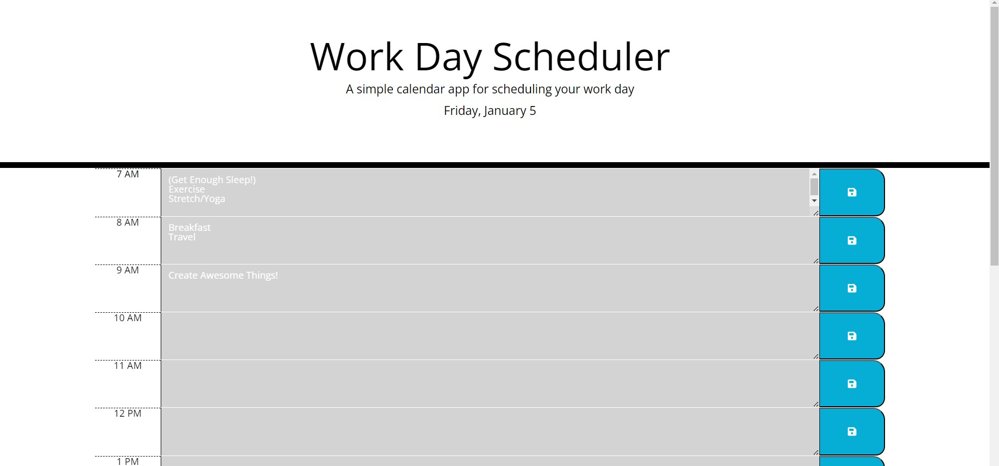

# Work Day Scheduler
Challenge for Week 7 using Javascript, jQuery, jQuery UI, and Day.js

## Description:

Planner with text entry sections
A simple browser-based calendar app. This project enables users to manage daily task schedules.
Current hour displays in red, timeblocks for future hours are in green, and previous hours are in grey. The save button stores entries in local memory, retaining them for the current browser session. 

## Link to Deployed Site:

https://add101.github.io/DailyPlanner/

## Screenshot:

